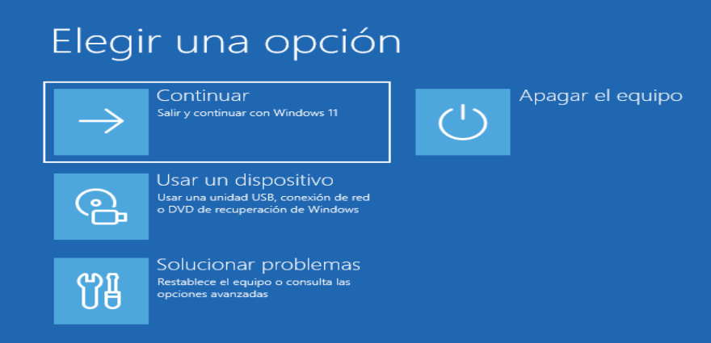
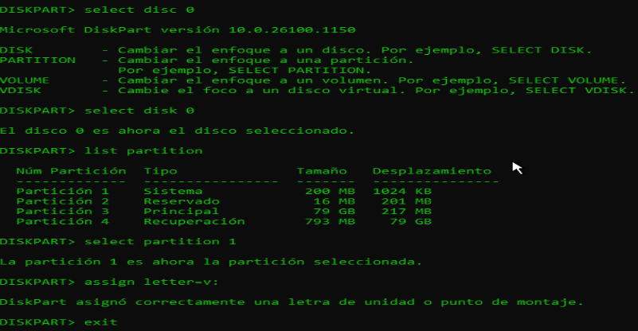

# Laboratorio-Repair-Windows-
Solución a la configuración del orden de arranque (Boot Priority) realizando una instalación limpia y reparación de BCD.

## 🚨 Problema en cuestión

  

---

## 🛠️ Laboratorio de Reparación y Mantenimiento de Windows

Este repositorio contiene la documentación de mis prácticas en entornos controlados (**VMware**) sobre reparación de sistemas operativos, recuperación de datos y gestión de errores.

### 🩺 Práctica 1: Recuperación del Arranque (Boot Repair) en Windows 11
**Problema:** El sistema no inicia debido a la corrupción del archivo BCD (Boot Configuration Data). Error: `0xc000000f`.

#### Pasos realizados:
1. **Simulación de fallo:** Eliminación de la partición EFI y el archivo BCD mediante `diskpart` y comandos `del`.
2. **Entorno de recuperación:** Inicio desde ISO de Windows 11 -> Solucionar problemas -> CMD.
3. **Comandos de reparación utilizados:**
   - `bootrec /fixmbr`: Reparación del registro maestro de arranque.
   - `bcdboot C:\Windows /l es-es`: Reconstrucción total de los archivos de arranque desde la imagen del sistema.

**Resultado:** Sistema recuperado exitosamente sin pérdida de datos.

---

## 💻 Gestión del Sistema vía CLI (Modo Server)
Práctica de administración de Windows prescindiendo de la interfaz gráfica (`explorer.exe`).

## ✅ Solución Paso a Paso:

### 1. Configuración de BIOS/Boot Manager
Lo primero es acceder al **Boot Manager** (o BIOS). Debemos priorizar el arranque desde el medio que contiene la ISO de Windows 11 (CD-ROM/DVD). Selecciona la opción **CD-ROM Drive** usando las flechas y presiona `Enter`.

  

### 2. Acceso al Menú de Recuperación
Una vez cargue el instalador, selecciona la opción **Reparar el equipo** en la esquina inferior izquierda.

  

### 3. Solucionar Problemas
Dentro del menú contextual, elegimos la opción de **Solucionar problemas**.

  

### 4. Abrir Símbolo del Sistema
Para realizar la reparación manual, iniciamos el **Símbolo del sistema**.

  

### 5. Ejecución de Comandos de Reparación
Con la consola abierta, introducimos el primer comando para reconstruir el almacén BCD:

  

Luego, ejecutamos el comando final para asegurar la correcta ruta de arranque:

  

### 6. Finalización
Para terminar, escribimos `exit` para cerrar la consola y seleccionamos **Continuar**. El sistema se reiniciará con el arranque totalmente reconstruido y funcional.

  

### 🩺 Práctica 2:Acceso denegado 

  

existen dos formas de solucionar el problema de esta forma entendesmos como hacer un bypass usando la fuerza bruta ypasarnos esa restriccion usar el paquete de comando diskpart que es muy importante saberlo el comando bootrec /fixboot está intentando escribir en una partición que Windows considera protegida o que está en un formato (como GPT/UEFI) que no permite el acceso directo de esa manera simple. 

## Solución: Formatear la estructura de arranque
## 1.Entra a ala herramienta de discos:
Escribe:`diskpart`
## 2. Lista tus Discos y selecciona el principal:
Escribe `list disk`(normalmente es el Disco 0, selecciona tu disco)
Escribe: `select disk 0`
## 3.Busca la particion oculta (EFI):
Escribe: list partition
Busca una que diga "Sistema" o "EFI" y que sea pequeña (100MB O 200MB)
## 4. Selecciona y dale una letra para poder entrar:
Escribe `Select partition X`(cambia Xpor el numero de esa particion).
Escribe: `assign letter=V:`
Escribe `exit`

 
  

## 5 Formatea esa particion de arranque (esto quita el bloqueo):
Escribe: `format V: /FS:FAT32`.
## 6. Crea los archivos de arranque de nuevo:
Escribre: `bcdboot C:\Windows /s V: /f UEFI` aqui estamos quitando la cerradura vieja, y poniendole una nueva y dandole la llave maestra al sistema.

Solucion aplicada reasignacion del BCD con el comando bcdboot

## "Pro-Tip" para tu laboratorio: 
Si alguna vez el comando simple de bcdboot falla, el "jefe final" de los comandos de arranque es este: 
`bcdboot C:\Windows /s V: /f ALL` 

 
  

- `/s Z:` Le dice exactamente en que letra de unidad esta la particion de arranque (la que montamos con `diskpart`).
- `/f ALL` Crea los archivos tanto para BIOS antigua como para UEFI moderna. Es la solucion universal.
Acostumbrarse a usar `bcdboot`.Es imprescindible ya que muchos ataques de Bootkits (virus que se meten en el arranque) se limpian precisamente regenerando BCD con este comando.
