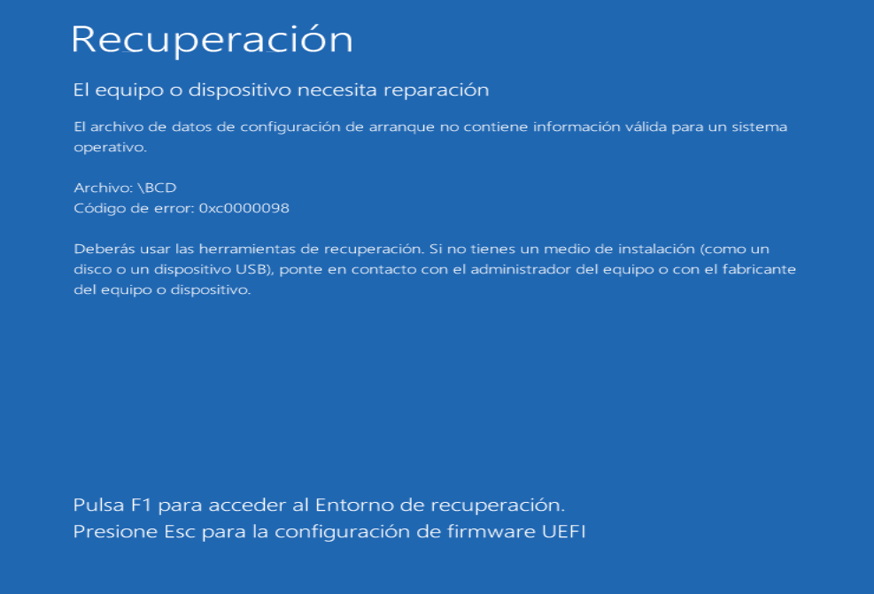
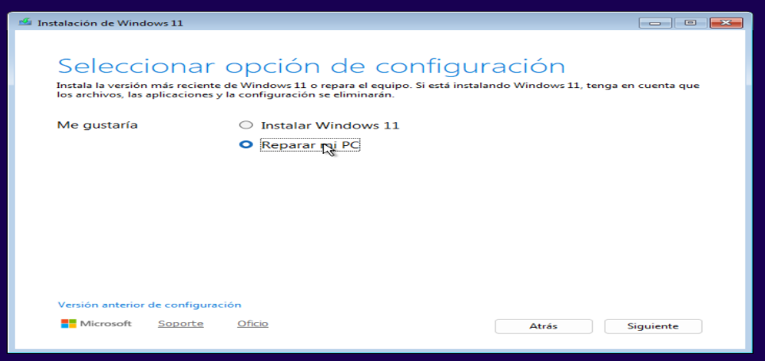

# Laboratorio-Repair-Windows-
solucion a la configuracion de el orden de arranque (Boot Priority) formateando con instalacion limpia.

# problema en cuestion
 

# 🛠️ Laboratorio de Reparación y Mantenimiento de Windows

Este repositorio contiene la documentación de mis prácticas en entornos controlados (VMware) sobre reparación de sistemas operativos, recuperación de datos y gestión de errores.

## 🩺 Práctica 1: Recuperación del Arranque (Boot Repair) en Windows 11
**Problema:** El sistema no inicia debido a la corrupción del archivo BCD (Boot Configuration Data). Error: `0xc000000f`.

### Pasos realizados:
1. **Simulación de fallo:** Eliminación de la partición EFI y el archivo BCD mediante `diskpart` y comandos `del`.
2. **Entorno de recuperación:** Inicio desde ISO de Windows 11 -> Solucionar problemas -> CMD.
3. **Comandos de reparación utilizados:**
   - `bootrec /fixmbr`: Reparación del registro maestro de arranque.
   - `bcdboot C:\Windows /l es-es`: Reconstrucción total de los archivos de arranque desde la imagen del sistema.

**Resultado:** Sistema recuperado exitosamente sin pérdida de datos.

## 💻 Gestión del Sistema vía CLI (Modo Server)
Práctica de administración de Windows prescindiendo de la interfaz gráfica (`explorer.exe`).

# Solucion:
lo primero que tenemos que hacer es entrar al boot manager o comunmente conocido como BIOS de la maquina y entrar en el disco donde esta el sistema operativo seleccionando la opcion de CD-ROM/DVD(donde esta la ISO de windows
11)usando las flechas del teclado que seria la segunda opcion que dice CDROM Drive (1.0) y presiona enter se tendria que ver de la siguiente manera: 

luego nos mandara a un menu contextual y elegimos en la opcion de reparar pc
 
 
 luego le damos en la opcion de solucionar problemas del sistema

 lo siguiente que necesitamos es tener el simbolo del sistema 

listo ahora teniendo la consola abierta introducimos el siguiente comando 

ahora introducimos el ultimo comando

 
